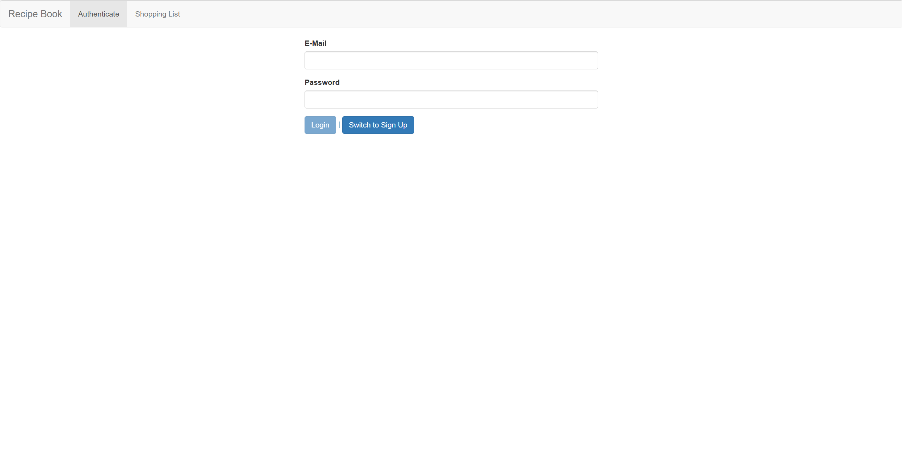

# Recipe Book and Shopping List

Welcome to the **Recipe Book and Shopping List** project! This web application allows users to manage recipes and shopping lists efficiently. Built with \*\*Angular \*\*and **Firebase**, it combines a sleek interface with powerful back-end support.

---

## Features

### 🖍 Recipe Management

- Add, edit, and delete recipes.
- View detailed recipe information, including ingredients and instructions.

### 🛒 Shopping List

- Add ingredients directly to your shopping list from recipes.
- Edit or remove items from the shopping list.

### 🔒 Authentication

- Secure user authentication via Firebase.
- Personalize your recipe book and shopping list based on your account.

### ☁️ Firebase Integration

- Real-time data storage and synchronization using Firebase.
- Access your recipes and shopping list from anywhere.

---

## Tech Stack

- **Front-End**: Angular&#x20;
- **Back-End**: Firebase Realtime Database and Authentication
- **Styling**: CSS

---

## Screenshots

### Recipe Management Page


### Shopping List Page


### Add Recipe 


### Authentication Page



---

## Installation

### Prerequisites

- Node.js
- Angular CLI

### Steps

1. Clone the repository:

   ```bash
   git clone https://github.com/Jaafar-Wannous/Recipe-book.git
   ```

2. Navigate to the project directory:

   ```bash
   cd Recipe-book
   ```

3. Install dependencies:

   ```bash
   npm install
   ```

4. Create environment files:

   - Create the folder `src/environments/` if it does not exist.
   - Add the following files:
     - `environment.ts` for development.
     - `environment.prod.ts` for production.

5. Add your Firebase configuration to these files. You can use the `environment.example.ts` file as a reference.

6. Run the application:

   ```bash
   ng serve
   ```

7. Open your browser and navigate to `http://localhost:4200/`.

---

## Setting Up Environment Variables

Create the environment files for your Firebase configuration:

### environment.example.ts

```typescript
export const environment = {
  production: false,
  firebaseConfig: {
    apiKey: 'YOUR_API_KEY',
    authDomain: 'YOUR_AUTH_DOMAIN',
    databaseURL: 'YOUR_DATABASE_URL',
    projectId: 'YOUR_PROJECT_ID',
    storageBucket: 'YOUR_STORAGE_BUCKET',
    messagingSenderId: 'YOUR_MESSAGING_SENDER_ID',
    appId: 'YOUR_APP_ID',
  },
};
```

### Steps:

1. Copy the content of `environment.example.ts` into `environment.ts` and `environment.prod.ts`.
2. Replace the placeholders (`YOUR_API_KEY`, etc.) with your Firebase project credentials.

---

## Usage

1. **Sign up**: Create an account to personalize your recipe book and shopping list.
2. **Add Recipes**: Use the "Add Recipe" feature to input recipe details, including ingredients.
3. **Shopping List**: Add ingredients from recipes to your shopping list or manage items directly.
4. **Edit/Delete**: Modify or remove recipes and shopping list items as needed.

---

## Contributing

Contributions are welcome! If you’d like to contribute:

1. Fork the repository.
2. Create a new branch for your feature or bugfix.
3. Submit a pull request with a detailed explanation of your changes.

---

## License

This project is licensed under the [MIT License](LICENSE).

---

## Contact

Feel free to reach out if you have any questions or suggestions:

- GitHub: [Jaafar-Wannous](https://github.com/Jaafar-Wannous)
- Email: jaafarwannous1@gmail.com(mailto\:YourEmail@example.com)

---

